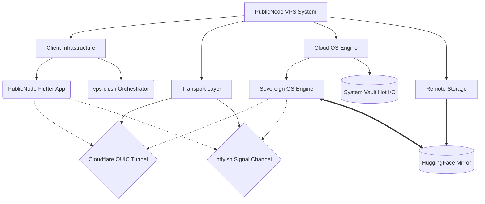

<div align="center">

# PublicNode VPS
**The Industrial-Grade Cloud Workstation Orchestrator**

[](vps-config.yaml)
[](LICENSE)
[]()
[]()

*Transform free Kaggle compute nodes into persistent, zero-latency, root-access Linux workstations with a single click.*

</div>

---

## 🌟 What is PublicNode?

PublicNode VPS is a high-performance orchestration layer and cross-platform terminal client. It is designed to bypass traditional networking bottlenecks by tunneling directly into cloud AI environments (like Kaggle), providing you with a fully persistent, secure, and incredibly fast remote desktop/terminal experience. 

Whether you are a developer looking for a free, persistent cloud workstation, or an engineer requiring absolute data sovereignty, PublicNode delivers a seamless, zero-config experience.

---

## 📂 Repository Structure

```text
.
├── vps-app/            # Flutter-based Glassmorphism Terminal Client
├── vps-os/             # Core Sovereign OS engine (Python 3.13)
├── scripts/            # Local CI/CD & Build Orchestration tools
├── vps-cli.sh          # Master Infrastructure Control Script
├── vps-config.yaml     # Single Source of Truth Configuration
├── publicnode-vps-engine/  # Kaggle Kernel Deployment Template
└── vps-storage/        # System Vault persistence metadata
```

---

## 🚀 Why Choose PublicNode?

*   **⚡ Zero-Latency Backbone:** Experience immediate terminal feedback. PublicNode leverages Cloudflare's global QUIC network to establish lightning-fast, encrypted tunnels directly to your cloud node.
*   **💾 1TB System Vault Persistence:** Never lose your work. The engine automatically compresses and syncs your entire system state (up to 1TB) to a private HuggingFace dataset, restoring it instantly upon your next session.
*   **🔒 Military-Grade Security:** Zero public attack surface. Connections are secured using dynamic session tokens, RSA encryption, and strictly authenticated SSH tunnels.
*   **📱 Premium Client App:** A stunning, Glassmorphism-inspired terminal viewer available on Android and Linux, featuring mobile-optimized toolbars, live telemetry, and an integrated file explorer.
*   **🛠️ Industrial Tooling Out-of-the-Box:** Boot into a perfectly configured environment equipped with Oh-My-Zsh, Python 3.13, Git, and Docker-ready capabilities.

---

## 📦 For Users: Installation & Usage

Getting started with the PublicNode Terminal Viewer is effortless. Download the client for your operating system and connect to your deployed node.

### 🐧 Linux (Universal Support: Ubuntu, Arch, Fedora, Kali, Mint)

The fastest way to install on any Linux distribution is via the Canonical Snap Store:

```bash
sudo snap install publicnode
```

> [!TIP]
> **Using a different Linux?** If you are on Arch, Fedora, Kali, or Mint and don't have Snap enabled, [click here](https://snapcraft.io/docs/installing-snapd) to see how to enable it on your system.

Alternatively, you can download the packages individually:
*   📦 [**Download .deb (Debian/Ubuntu)**](https://github.com/myth-tools/PublicNode/releases/latest)
*   📦 [**Download .rpm (Fedora/RHEL)**](https://github.com/myth-tools/PublicNode/releases/latest)

**Installation:**
*   **Debian/Ubuntu:** `sudo dpkg -i publicnode-*.deb`
*   **Fedora/RHEL:** `sudo rpm -i publicnode-*.rpm`

### 📱 Android

Download the 📱 [**Latest .apk (Android)**](https://github.com/myth-tools/PublicNode/releases/latest) and sideload it onto your device. The mobile app features a specialized virtual keyboard designed for terminal power users.

### ⚡ Quick Connect
1. Open the PublicNode app.
2. Tap **Ignite Cloud VPS**. 
3. The app will securely negotiate the tunnel, fetch the dynamic credentials, and automatically drop you into a persistent root shell.

---

## 🛠️ For Developers: Hosting Your Own Node

If you want to host your own PublicNode backend using your personal Kaggle and HuggingFace accounts, follow this setup guide.

### 1. Prerequisites
To enable the orchestration engine, you must configure your cloud provider API keys:
*   **Kaggle API (`kaggle.json`)**: Required to boot the compute nodes. You **must** verify your phone number on your [Kaggle Account](https://www.kaggle.com/settings) to use the API.
*   **HuggingFace Token**: Required for the System Vault storage. Create an Access Token with **WRITE** permissions.

### 2. Configuration
Clone this repository and edit the master configuration file:

```bash
git clone https://github.com/myth-tools/PublicNode.git
cd PublicNode
# Edit your settings
nano vps-config.yaml
```
*Ensure you update `identity.kaggle_username` and `identity.hf_repo` with your own details.*

### 3. Infrastructure CLI Orchestration
The root directory contains `vps-cli.sh`, a hardened bash script used to orchestrate your cloud infrastructure.

| Command | Description |
|:---|:---|
| `./vps-cli.sh boot` | Build the engine, sync assets, and ignite the remote VPS node. |
| `./vps-cli.sh ssh` | Manually establish an encrypted SSH tunnel to the active node. |
| `./vps-cli.sh status` | Pulse the signal channel for real-time telemetry and health checks. |
| `./vps-cli.sh stop` | Send a secure shutdown signal to gracefully terminate the remote node. |

---

## 🏗️ System Architecture

PublicNode utilizes a highly decoupled, decentralized architecture to maintain speed and data sovereignty.



---

## ⚙️ Local CI/CD Pipeline

PublicNode uses a fully local, automated CI/CD distribution pipeline. No GitHub Actions required. The orchestrator automatically runs codebase audits, compiles all targets, and publishes them.

**To build and release a new version:**
```bash
# Full release: audit → build APK, DEB, RPM, Snap → tag → push to GitHub Releases
make release

# Build without publishing (Testing)
uv run vps-release --dry-run

# Publish to GitHub AND the Canonical Snap Store
uv run vps-release --snap-store
```
*Note: Ensure you have `flutter`, `dart`, `snapcraft`, and `gh` installed on your host machine to utilize the full pipeline.*

---

## 🛠️ Troubleshooting & Best Practices

To ensure a smooth experience with PublicNode, follow these guidelines:

### 1. Identity Verification Issues
If you see **IDENTITY UNVERIFIED** on the Connect screen:
- Go to **Settings** and verify your Kaggle Username and API Key.
- Ensure your Kaggle account is **phone verified** (required by Kaggle for API access).
- Check your internet connection; the app pulses the Kaggle API to ensure your credentials are valid before ignition.

### 2. Boot Sequence Stalls
If the progress bar stops or you see a **KERNEL_TIMEOUT**:
- Check the **Live Engine Monitor** (Monitor icon in the top right).
- Common cause: Kaggle quotas exceeded or GPU/TPU resources unavailable in your region.
- Solution: Try again in a few minutes or check your Kaggle account for active kernels.

### 3. Synchronization (System Vault)
PublicNode uses an **Autonomous Sync Loop**:
- The system automatically mirrors your workspace to HuggingFace after 5 minutes of filesystem silence.
- You can manually trigger a sync via the **Secure Workspace** button in the Command Center.
- **Tip:** Always perform a manual **Commit Snapshot** before a long break to ensure absolute data persistence.

### 4. Connection Failures (WebSocket)
If you get a "Connection Refused" error:
- This usually means the Cloudflare tunnel hasn't fully propagated yet. 
- Wait 30 seconds and tap **SYNC** in the top right to refresh the backbone signals.

---

## 🤝 Contributing & Support

We welcome contributions from developers worldwide! Whether it's enhancing the Flutter UI, optimizing the Python engine, or expanding packaging support, your pull requests are appreciated.

If you encounter issues or have feature requests, please open an issue on the [GitHub Repository](https://github.com/myth-tools/PublicNode).

---

<div align="center">
  <p>Copyright (c) 2026 mohammadhasanulislam. Licensed under the <strong>GNU GPLv3 License</strong>.</p>
  <p><em>Built by the community, for the community.</em></p>
</div>
